>[!SUMMARY] Table of Contents
>- [[Reinforcement Learning Basic Course#Introduction of RL|Introduction of RL]]
>    - [[Reinforcement Learning Basic Course#Inside an RL agent|Inside an RL agent]]
>    - [[Reinforcement Learning Basic Course#Maze Example|Maze Example]]
>- [[Reinforcement Learning Basic Course#Markov Decision Process|Markov Decision Process]]
>    - [[Reinforcement Learning Basic Course#Markov Property|Markov Property]]
>    - [[Reinforcement Learning Basic Course#Markov Process|Markov Process]]
>    - [[Reinforcement Learning Basic Course#Markov Reward Process MRP|Markov Reward Process MRP]]
>    - [[Reinforcement Learning Basic Course#Value Function|Value Function]]
>    - [[Reinforcement Learning Basic Course#Bellman Equation for MRPs|Bellman Equation for MRPs]]
>    - [[Reinforcement Learning Basic Course#Markov Decision Process MDP|Markov Decision Process MDP]]
>- [[Reinforcement Learning Basic Course#Planning by Dynamic Programming|Planning by Dynamic Programming]]
>    - [[Reinforcement Learning Basic Course#Policy Evaluation|Policy Evaluation]]
>    - [[Reinforcement Learning Basic Course#Policy Iteration|Policy Iteration]]
>    - [[Reinforcement Learning Basic Course#Value Iteration Algorithm|Value Iteration Algorithm]]
>    - [[Reinforcement Learning Basic Course#Extensions to DP|Extensions to DP]]
>- [[Reinforcement Learning Basic Course#Model-free Prediction|Model-free Prediction]]
>    - [[Reinforcement Learning Basic Course#Monte-Carlo Learning|Monte-Carlo Learning]]
>    - [[Reinforcement Learning Basic Course#Temporal-Difference Learning|Temporal-Difference Learning]]
>    - [[Reinforcement Learning Basic Course#Batch MD and TD|Batch MD and TD]]
>    - [[Reinforcement Learning Basic Course#MC vs TD|MC vs TD]]
>    - [[Reinforcement Learning Basic Course#MC vs TD vs DP backups|MC vs TD vs DP backups]]
>    - [[Reinforcement Learning Basic Course#Bootstrapping and Sampling|Bootstrapping and Sampling]]
>    - [[Reinforcement Learning Basic Course#TD($\lambda$)|TD($\lambda$)]]
>    - [[Reinforcement Learning Basic Course#TD(0) and TD($\lambda$)|TD(0) and TD($\lambda$)]]
>    - [[Reinforcement Learning Basic Course#Summary of Forward and Backward TD($\lambda$ )|Summary of Forward and Backward TD($\lambda$ )]]
>- [[Reinforcement Learning Basic Course#Model Free Control|Model Free Control]]
>    - [[Reinforcement Learning Basic Course#On-Policy Monte-Carlo Control|On-Policy Monte-Carlo Control]]
>    - [[Reinforcement Learning Basic Course#On-Policy Temporal Difference Learning|On-Policy Temporal Difference Learning]]
>    - [[Reinforcement Learning Basic Course#Off-Policy Learning|Off-Policy Learning]]
# Introduction of RL

Reinforcement learning is studying the science of decision making which makes it very general.

  

Reinforcement learning is different from other machine learning paradigms because:

  

1. There is no supervisor, only reward signal ( bad/good behavior , but not quantification of it like how much bad it was)

2. The feedback is not instantaneous, it can be delayed from a set of steps

3. Times really matters in RL ( it is a set of sequential steps , we don’t have i.i.d data as in the supervised classical problems )

4. There is an agent(e.g. a robot ) moving through the world

5. The agent is influencing the data that he is actually seeing ( he moves in the world that he is studying we can say )

  

A reward is a scalar feedback signal ( a number ) that says how well is the agent doing at that time step $R_t$. The job of the agent is to sum up these rewards and get as much reward as possible in total.

  

> All goals can be described by the maximisation of expected cumulative reward

>

  

For different types of problem the goal is the same: we want to selects actions that maximise total future reward.

  

Reward can be delayed so we should think ahead: it is possible that we need to sacrifice immediate reward to gain more long-term reward.

  

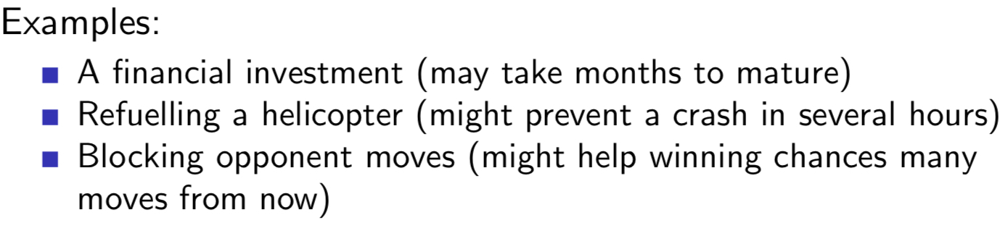

  

Our goal is to build this brain which represents the agent:

  

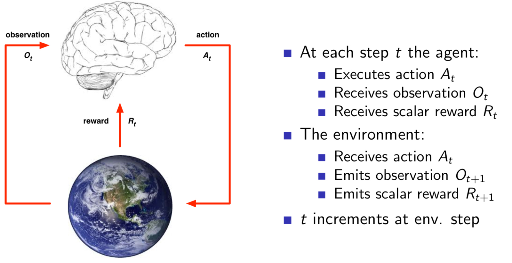

  

The world is the environment.

  

The **history** is what the agent has been seen so far: a sequence of observations, actions and rewards

  

$$

H_t = O_1 , R_1 , A_1 , ... , A_{t-1} , O_t , R_t

$$

  

These are all the **observable variables** up to time t ( the things that are not exposed to our agent can not be taken into consideration for building a correct algorithm and they should be ignored ).

  

Our algorithm is just a mapping from the history to the next action.

  

**State** is a function of the history used to determine what happens next:

  

$$

S_t = f(H_t)

$$

  

We have 3 different definitions of state:

  

1. Environment state $S_t^e$ : information used within the environment to determine what happens next.

2. It is not visible to the agent and it does not give us any relevant information for building up our algorithm

  

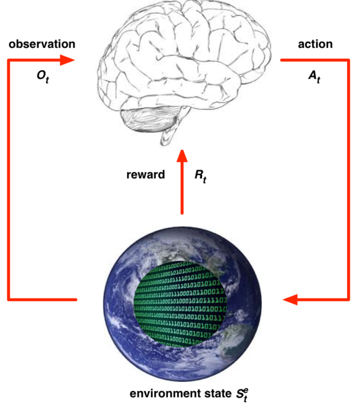

  

1. Agent state $S_t^a$ : information that summarize what happens so far used by the agent to pick the next action.

2. It is the information by RL algorithms

3. It can be any function of history $S_t^a = f(H_t)$

  

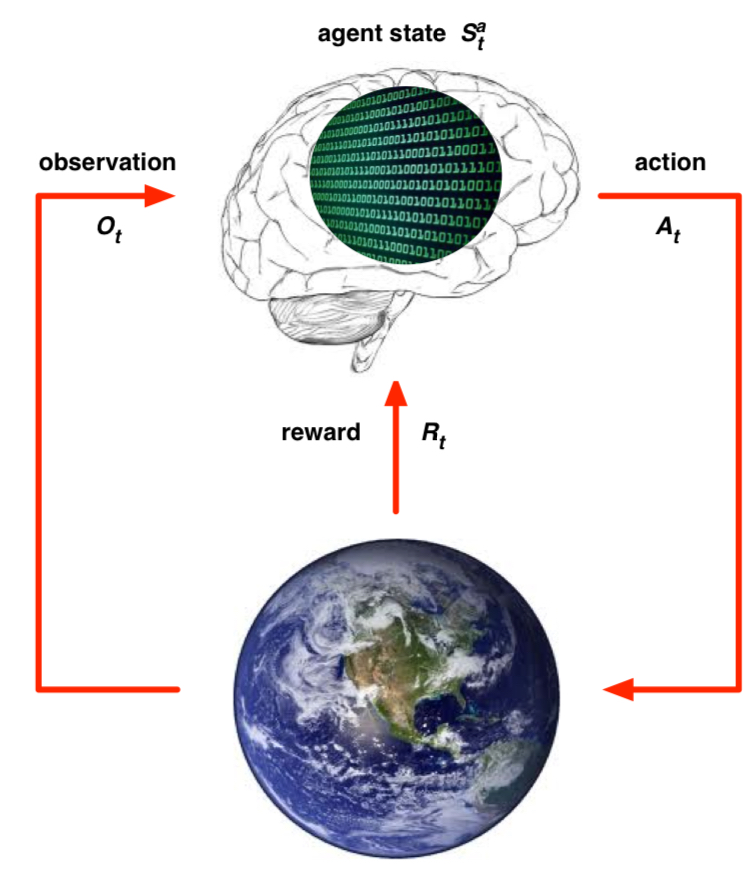

  

1. Information state / Markov State : it contains all useful information from the state ( it is a much more mathematical concept )

2. A state is Markov if it satisfies the **markov property** ( the future is independent of the past given the present )

  

$$

P[S_{t+1} | S_t ] = P[S_{t+1} | S_1 , . . . , S_t ]

$$

  

We can throw away the history once the state is known ( the state is a sufficient statistic of the future ).

  

Both environment and history are Markov states.

  

The environment can be:

  

- Fully observable → agent directly observers environment state

  

$$

O_t = S_t^a = S_t^e

$$

  

The observation is equal to the state of the environment and to the state of the agent.

  

This is a Markov Decision Process ( MDP ).

  

It is the nicest case.

  

- Partially observable → agent indirectly observes environment

  

$$

S_t^a \neq S_t^e

$$

  

This is a partially observable Markov Decision Process ( PO-MDP )

  

The agent must construct its own state representation $S_t^a$ , it can:

  

1. Use the whole history $S_t^a = H_t$

2. Build a beliefs of environment state ( bayesian approach ) → i keep probability distribution of where i am in the environment

$S_t^a = (P[S_t^e = s^1] , . . . , P[S_t^e = s^n])$

3. Recurrent neural network ( linear combination between the previous agent state and the current observation )

$S_t^a = \sigma(S^a_{t-1} W_s + O_t W_o)$

  

## Inside an RL agent

  

RL agent may include one or more of these components:

  

1. Policy → how the agent picks its actions , its behaviour function.

  

It is a map from state to action , it can be

  

- Deterministic → $a = \pi(s)$

- Stochastic → $\pi(a|s) = P[A_t=a| S_t = s]$

1. Value function → how good is it to be in a particular state or how much reward i get to perform a specific action

  

It is a prediction of future reward and it is used to select between actions

  

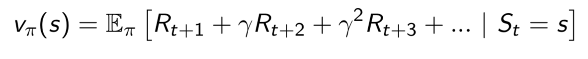

  

It says how much reward the agent will get if it continues to follow the current set of actions.

  

1. Model → how the agent thinks the environment works

2. It is not the really environment but just the agent’s view of it

3. It is a prediction of what the environment will do next

  

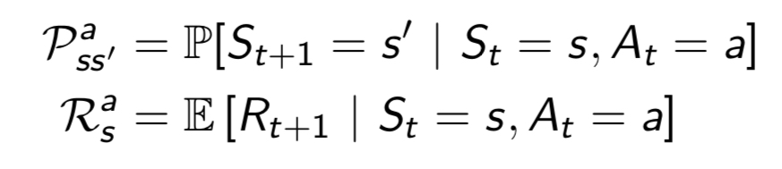

  

$P$ predicts the next state

  

$R$ predicts the next reward

  

## Maze Example

  

This is the problem that we want to solve:

  

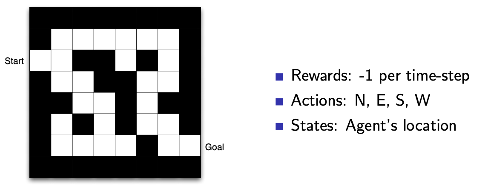

  

We want to find the path to got outside the maze.

  

We need to define:

  

- Policy → a deterministic policy can be a set of pre-defined movements that the agent has to do when he is in a specific position.

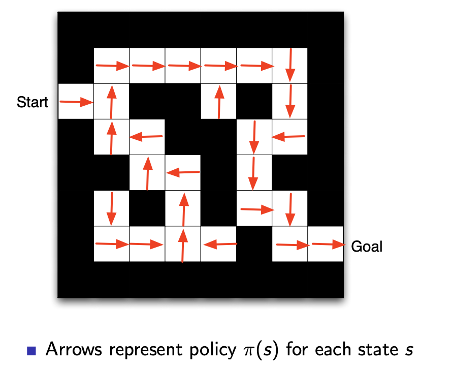

- Value Function → we give numbers to each position, the next action will be the one that minimizes it.

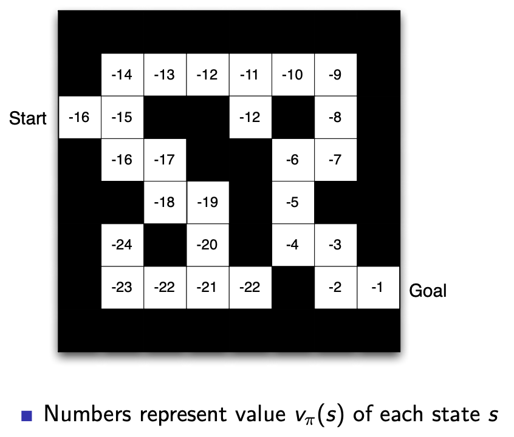

- Model → how the agent thinks the environment is

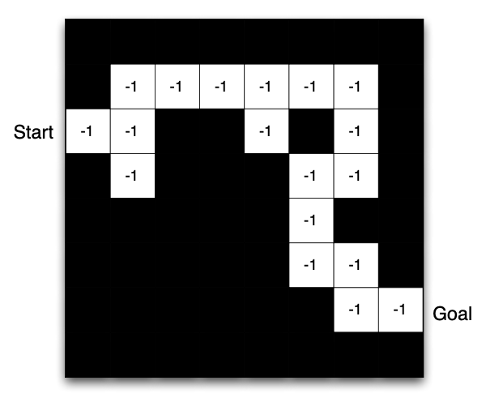

  

Numbers represent immediate reward $R_s^a$ from each state s.

  

We can categorize our RL agents using this 3 components:

  

- It is a **value based** agent if it contains a value function and the policy becomes/is implicit.

- It is a **policy based** agent if we explicitly represent the policy without using the value function.

- **Actor critic** is an agent that uses both policy and value function.

  

An RL agent can be

  

- Model Free → we don’t try to explicit understand the environment ( no model )

- Model based

  

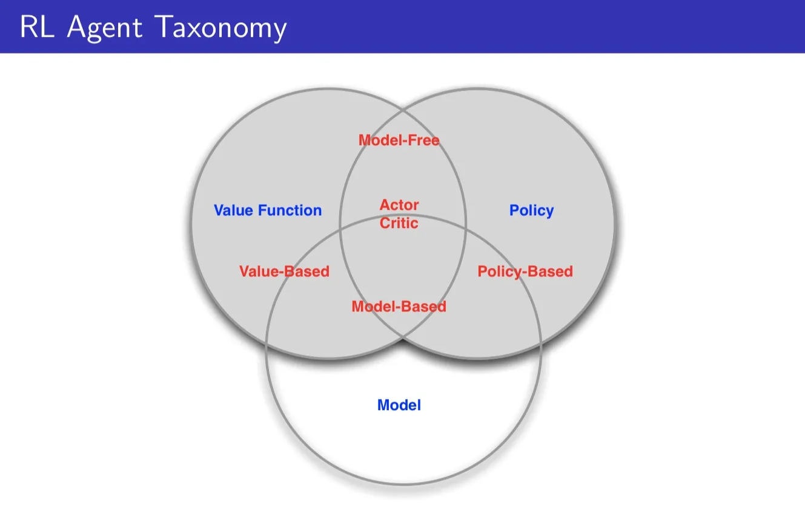

  

There are 2 problems related to sequential decision making:

  

1. Reinforcement Learning problem:

2. The environment is initially unknown

3. The agent interacts with the environment and it improves its policy

4. Planning problem

5. A model of the environment is known (e.g. the rules of a game )

6. The agent does not interact with the external environment but it performs computations with its model improving its policy.

  

RL learning is a *trial-and-error* learning: we want to find a good policy from its experience of the past without loosing too much reward along the way.

  

We want to find a balance between:

  

- Exploration → finds more information about the environment giving up some rewards we know about

- Exploitation → exploits the information you already found to maximise reward

  

  

We must also highlight a distinction between:

  

- Prediction → it evaluates the future given a policy

  

  

- Control → it optimises the future ( it finds the best policy )

  

  

# Markov Decision Process

  

MDP is the formal description of an environment for RL where the environment is fully observable ( the current state is fully observable ).

  

All the RL problems can be formalised as MDPs.

  

## Markov Property

  

The future is independent from the past given the present

  

  

The state captures all relevant information from the history

  

The probability of moving from a state s to the a successor state s’ is called **state transition probability:**

  

$$

P_{ss'}=P[S_{t+1} = s' | S_t = s]

$$

  

We can define the **state transition matrix $P$** that considers all the combinations:

  

  

Each row of the matrix sums to 1 ( given a state , all the possible next choice probabilities must sum to 1 ).

  

## Markov Process

  

A markov process is a memoryless random process: a sequence of random states $S_1 , S_2 , . . .$ with the Markov Property

  

  

Example of student markov chain with its transition probability matrix

  

  

## Markov Reward Process MRP

  

A Markov reward process is a Markov chain with values

  

  

The reward function tells us how much reward we get if we stay in a state $S_t = s$ ( immediate reward ).

  

Let’s see our example of the student MRP

  

  

⚠️ when we leave a state we will obtain the specified reward independetly from the next state.

  

e.g. when i leave the state class 1 i will get always R=-2.

  

The goal of the Reinforcement Learning is to maximise the return $G_t$ which is the total discounted reward from time-step t

  

$$

G_t = R_{t+1} + \gamma R_{t+1} + . . . = \sum_{k=0}^{\infty} \gamma^k R_{t+k+1}

$$

  

$R_{t+1}$ is the immediate reward and then we have the future rewards discounted properly: the discount is $\gamma \in [0,1]$ and it tells how much i care now about rewards i’ll get in the future.

  

$\gamma$ is more about *how much you value* future rewards, not necessarily how much you *trust* your predictions:

  

- If $\gamma = 0$ means you're completely myopi ( you only care about the immediate reward $R_{t+1}$) Future rewards literally don't factor into your decision at all. It's not that you don't trust your predictions; you simply don't care about the future.

- Myopic evaluation

- If $\gamma = 1$ means you value a reward 100 steps from now exactly as much as a reward right now. There's no discounting at all—every future reward counts equally.

- Far-sighted evaluation

  

We are weighting the importance of future reward in our decision.

  

Why Markov reward and decision processes are discounted?

  

- Mathematically convenient ( the sum to $\infty$ will converge )

- Future is uncertain because we do not have a perfect model of the environment

- We can also use undiscounted Marko reward processes ( i.e. $\gamma = 1$ ) if all sequences terminate

  

## Value Function

  

The value function $v(s)$ is the long-term value of being in the state s

  

  

In other words, what is the total reward that you will get from this state on.

  

Let’s go back to the example of Student MRP and we will analyze the sample returns for it:

  

  

Each row is a sample, each sample represents a different sequence of steps.

  

Let’s see several examples of the value function with different discount values:

  

  

We take into account only the immediate reward, in other words $v(s) = E[R_{t}]$

  

  

  

## Bellman Equation for MRPs

  

The value function can be decomposed into two parts:

  

1. Immediate rewards $R_{t+1}$

2. Discounted value of successor state $\gamma v(S_{t+1})$

  

  

Bellman equation is then

  

$$

v(s) = E[ R_{t+1} + \gamma v(S_{t+1}) | S_t = s ]

$$

  

We can represent it using the backup diagram which is a one-step look ahead search

  

  

$$

v(s) = R_s + \gamma \sum_{s' \in S} P_{ss'} v(s')

$$

  

We get the value function at this step by averaging all the possible outcomes together.

  

In particular:

  

The summation $\sum_{s' \in S} P_{ss'} v(s')$ is computing an **expectation : we**'re weighting each possible next state's value $v(s')$ by the probability $P_{ss'}$ of actually transitioning there, then summing them all up.

  

Computation example:

  

  

We have just selected one state: the red one.

  

We can express the bellman equation using matrices:

  

$$

v = R + \gamma P v

$$

  

  

Where:

  

- v is a column vector with one entry per state.

- R is a column vector where each entry tells how much reward i get by exiting that state.

  

Bellman equation in this case is a linear equation so it can be solved directly:

  

  

Its complexity is $O(n^3)$ where n is the number of states.

  

This is an usable solution only for small MRPs, but for large MRPs we shall use iterative methods:

  

- Dynamic programming

- Monter-Carlo evaluation

- Temporal-Difference learning

  

## Markov Decision Process MDP

  

It is a Markov reward process MRP with decisions. It is an environment in which all states are Markov.

  

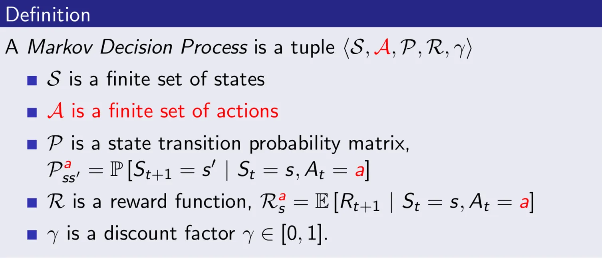

  

The reward function now depends both on the state and on which type of action we take.

  

We just need to consider actions: the transition probability matrix depends on which action we take; in a discrete context, we have a different state transition probability for each action $a$.

  

  

The decisions are the red strings on the arcs

  

### Stochastic Policy

  

A policy $\pi$ is a distribution over actions given states

  

$$

\pi(a|s) = P[A_t = a | S_t = s]

$$

  

In other words: if you are in some state s, the distribution gives us the mapping of the probability of a specific action ( if i am here, which is the probability of going right? Or left? )

  

**The policy defines the behaviour of an agent**.

  

Policy property:

  

- In an MDP, the policy depends on the current state ant not on the whole history for the markov property.

- The policies are time independent , they are **stationary** ( they only depend on the state and not the time step )

  

Given an MDP $M = <S, A, P, R, \gamma>$ with policy $\pi$, we can always recover:

  

- Markov Process from it

- The state sequence $S_1 , S_2 , . . .$ is a MP

- Markov Reward Process from it

- The state and reward sequence $S_1, R_2, S_2 , . . .$ is a MRP $<S, P^\pi , R^\pi , \gamma >$

- $P^\pi_{ss'} = \sum_{a\in A} \pi(a|s) P^a_{ss'}$

- $R^\pi_{ss'} = \sum_{a\in A} \pi(a|s) R^a_{ss'}$

- We are just averaging over all the policy values.

  

### Value function

  

We define two types of value functions:

  

The **state-value** function $v_\pi(s)$ of an MDP is the expected return starting from state s and then following policy $\pi$

  

$$

v_\pi(s) = E_\pi[G_t| S_t=s]

$$

  

There is no one expectation anymore but there are different ones depending on how i behave.

  

The value function must be subscribed to a specified policy, in other words **it expresses how good is to be in particular state s if i’m following the $\pi$ policy.**

  

The **action-value** function $q_\pi(s,a)$ of an MDP is the expected return starting from state s, taking action a, and then following policy $\pi$

  

$$

q_\pi(s,a) = E_\pi[G_t | S_t=s, A_t=a]

$$

  

I**t tells how good is to take a particular action when we are in a particular state**

  

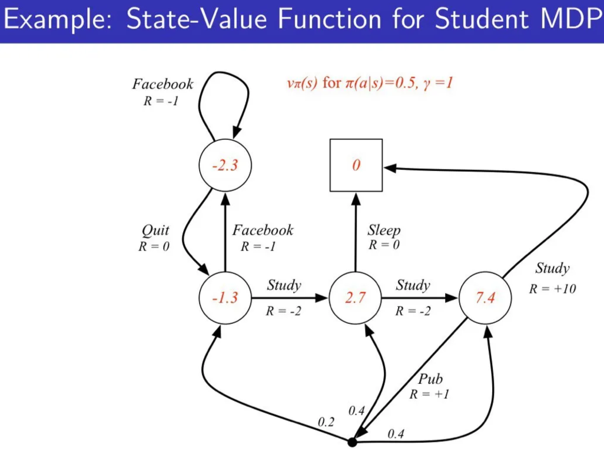

  

### Bellman Expectation Equation

  

The value function can be decomposed into an immediate reward plus discounted value of successor state.

  

This approach can be used for both:

  

- State-value function

  

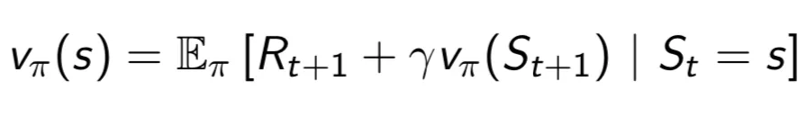

  

  

We are averaging on the actions we might take.

  

Open circle represents state meanwhile filled circles are for actions

  

- Action-value function

  

  

  

We start off by taking some actions , we are considering a specific action as the root of the tree and we are averaging by the successor states.

  

We can now stitch together the two previous concepts:

  

- Bellman Expectation Equation for $v_\pi(s)$

  

  

At the root of the tree we got the value function for a particular state V which tells us how good is it to be in a particular state and the way we are going to understand it is to use a two-step look ahead: we consider all the actions we might take next and how good is it to be in the successor states we can end after the action.

  

The idea behind the math is: the value function at the current time step is equal to the immediate reward plus the value function of where you end up.

  

- Bellman Expectation Equation for $q_\pi(s,a)$

  

  

Starting from a particular state and action , i can consider the next state i can end and then the possible actions i can take from them. I can average everything like in the previous case.

  

**Example**: Bellman expectation equation in Student MDP

  

  

We are considering only the red state, we want to verify that the value function of the third state 7.4 is correct.

  

The point is not a state: you are teleported instantly to one of the three states.

  

The value function is computed by considering:

  

- both probabilities of the two next states we can end up ( Study or Pub ) , we are assuming 50% 50%.

- If we study, we get a 10 reward ( 0.5 * 10 )

- If we go into a pub, we might go to multiple states each with a specific probability ( e.g. 0.4 that i come back to the exact same state of before )

- I multiply each probability with each value function and i sum up for all the possible states.

  

Bellman expectation equation can be expressed using the induced MRP:

  

$$

v_\pi = R^\pi + \gamma P^\pi v_\pi

$$

  

Value function can be computed directly as we have seen before

  

$$

v_\pi = (I-\gamma P^\pi)^{-1} R^\pi

$$

  

We will see other more efficient way of finding its solution.

  

### Optimal Value Function

  

In general we want to find the optimal way to solve your problem ( we want to find the best path through the system ).

  

The optimal value function is defined as:

  

- Optimal state-value function $v_*(s) = \max_\pi v_\pi(s)$

  

It is the maximum value function over all policies: we care about the best of all the policies we can follow, in other words we care about understanding what is the maximum possible amount of reward in expectation we can extract from the system.

  

  

- Optimal action-value function $q_*(s,a) = \max_\pi q_\pi(s,a)$

  

It is the maximum action-value function over all policies.

  

It tells us the maximum amount of rewards you can extract in state s and taking action a, in other words: it tells us the most possible reward we can get if we are in a state s and we take an action a. It tells us immediately the right action to take: **solving an MDP means finding an $q_\star(s,a)$.**

  

  

### Optimal Policy

  

The thing that we care about is the optimal policy: the best optimal way of behaving in an MDP.

  

A policy is just a stochastic mapping from states to actions that we take. We need to define a partial ordering over policies ( to define optimality we need to compare policies ):

  

$$

\pi \geq \pi' \quad \text{if} \quad v_\pi(s) \geq v_{\pi'}(s), \forall s

$$

  

One policy is better than another policy if the value function for that policy is greater than the value function of the other one in all the states. It means that if for one state, the value function is worse than the other , the policy is not greater or equal.

  

  

We can find the optimal policy by maximizing over $q_\star(s,a)$

  

  

We pick the action that gives us the most $q_\star(s,a)$: in a state s we just pick the action a with probability 1 if taking that action will give us the maximum possible reward.

  

There is always a deterministic optimal policy for any MDP.

  

If we know $q_\star(s,a)$ , we immediately have the optimal policy.

  

**Example:** optimal policy for student MDP

  

  

We take the action , for each state, that maximizes $q_\star$ : e.g. in the third state ( last one on the right ) we choose to go to study because the $q_\star = 10$ and going to a pub is $q_\star = 8.4$.

  

### Bellman Optimality Equation

  

- Bellman Optimality Equation for $v_\star$

  

  

Look at the action you can take and pick the max of them ( we are not averaging as before )

  

- Bellman Optimality Equation for $q_\star$

  

  

In this case we don’t know what the environment / dynamic might do to us : it is like going to the Pub and we don’t know what it happens and where we will end up. Each of those states that we end up in has some optimal value and we just average them.

  

We don’t take the maximum because we don’t know where the wind will blow us, we can just average it.

  

We can now put these two pieces together and we have:

  

- Bellman optimality equation for $v_\star$

  

  

Max operation is applied to all the equation.

  

we have a recursive relationship that relates $v_\star$ to itself.

  

It is two step look ahead: we are looking ahead over the actions we can take here and maximizing over those and we are also looking ahead over the dice that the environment might roll ( we don’t control the dice so we can not maximizing it instead we average over the dice that the environment can roll ).

  

- Bellman optimality equation for $q_\star$

  

  

We can do the same think but for q, getting a recursive relationship. We average over the dice , so wherever the wind gets us we have to take an action and we will take the one that maximizes the $q_\star$.

  

**Example**: Bellman optimality equation in student MDP

  

  

Here we are not considering any noise: if we take that action (e.g. Facebook ) we are always ending in a specific state ( e.g. upon ). In this example we are computing the $v_\star(s)$ for the red state: we are taking the maximum values between the two $v_\star$ that we have after taking two different actions.

  

### Solving the Bellman Optimality Equation

  

Bellman optimality equation is non linear ( the max operation is fundamentally nonlinear ) and in general it has not a closed form solution therefore we need iterative solution methods:

  

- Value iteration

- Policy iteration

- Q-learning

- Sarsa

  

# Planning by Dynamic Programming

  

Dynamic programming is a method for solving complex problems by breaking them down into subproblems: we solve subproblems and then we combine their solutions.

  

Dynamic programming is a general solution method for problems which have two properties:

  

- Optimal substructure → optimal solution can be decomposed into subproblems

- Overlapping subproblems → solutions can be cached and reused because subproblems recur many time

  

MDPs satisfy both properties:

  

1. Bellman equation are recursive

2. Value function stores and reuses solutions

  

Dynamic Programming assumes full knowledge of the MDP therefore it is used for *planning problems* where the environment is known ( we have a model for it ).

  

We can solve two special cases of planning an MDP

  

1. Prediction problem, given as input an MDP $<S, A, P, R, \gamma >$ and a policy $\pi$ , the output will be the value function $v_\pi$

2. Control problem, given as input an MDP $< S, A, P, R ,\gamma >$ we get as output both optimal value function $v_\star$ and optimal policy $\pi_\star$

  

## Policy Evaluation

  

We want to evaluate a given policy $\pi$ by an iterative application of Bellman expectation backup.

  

We will start with an arbitrary initial value function $v_1$ ( it can be seen as a vector of all 0 ) , we apply one iteration of the bellman expectation to get $v_2$ and so on for many times and at then we end up with the true value function $v_\pi$ ( the convergence will be discussed later ).

  

We will do it by using synchronous backups:

  

- At each iteration k+1

- We consider all the states $s \in S$

- Synchronous because we are considering all the states at any step

- Update the value function $v_{k+1}(s)$ from $v_k(s')$ where s’ is the successor state of s

  

The value function of the next iteration can be defined as:

  

  

$$

v_{k+1}(s) = \sum_{a \in A} \pi(a|s) \left( R_s^a + \gamma \sum_{s' \in S} P_{ss'}^a v_k(s') \right)

$$

  

**Example**: Evaluating a random policy in the small gridworld

  

  

A 4x4 grid where the shaded states are the terminal states ( if you end up in this state , no more reward, you get blocked there, end of the episode ).

  

In each state we have 4 actions ( right, left, up and down ) , we get a reward of -1 per step regardless of which action we take: we want to understand how long it takes you to reach one of these gray state where the reward is 0 ( how many steps? ) .

  

It is an undiscounted episodic MDP ( $\gamma =1$ ).

  

We can consider the simplest policy we can think of which is uniform random: each action has 1/4 probability of being chosen.

  

$$

\pi(n|\cdot) = \pi(e|\cdot) = \pi(s|\cdot) = \pi(w|\cdot) = \frac{1}{4} = 0.25

$$

  

  

  

The initial estimate is just 0 everywhere.

  

Any value function can be used to compute a better value function.

  

## Policy Iteration

  

We want to make our policy better, how can we do that?

  

Given a policy $\pi$:

  

1. We **evaluate** the policy

  

$$

v_\pi(s) = E[R_{t+1} + \gamma R_{t+2} + ... | S_t = s]

$$

  

1. We **improve** the policy by acting greedy wrt $v_\pi$ ( as we did in the right column of the last example )

  

$$

\pi' = \text{greedy}(v_\pi)

$$

  

In general, this process needs more iteration of improvement/evaluation but this process of **policy iteration** always converges to $\pi_*$

  

  

We start from some inputs as V ( all 0 ) and $\pi$ ( a policy ): we have a cycle of evaluation and improvement where first we compute the value function according to the current policy and then we update the policy taking into account the value function.

  

In the graph going up means policy evaluation ( by iterative approach ) and going down means policy improvement ( by acting greedy ).

  

We are going now to express this idea in a more formal way:

  

1. We start off with some deterministic policy $a = \pi(s)$

2. We improve our policy by acting greedily

  

$$

\pi'(s) = \argmax_{a\in A} q_\pi(s,a)

$$

  

1. Acting greedily improves the value from any state s over just one step

  

$$

q_\pi(s,\pi'(s)) = \max_{a \in A} q_\pi(s,a) \geq q_\pi(s,\pi(s)) = v_\pi(s)

$$

  

It says that the action-value function following the $\pi$ policy but applying the $\pi'$ only for the next step for choosing the action it is always greater or equal to the action-value function following the $\pi$ policy and applying also $\pi$ to the next step.

  

It is a mathematical way of saying: the value function improves over one step at least.

  

1. We can iterate this approach using a telescoping argument

  

  

The first line says that taking our greedy policy for one step is better than the thing we started with.

  

We unroll this definition to show that this is true for multiple step: it is better for two steps, for three and so on ).

  

1. If the improvements stop then the bellman optimality equation has been satisfied.

  

$$

q_\pi(s,\pi'(s)) = \max_{a\in A} q_\pi(s,a) = q_\pi(s,\pi(s)) = v_\pi(s)

$$

  

Therefore $v_\pi(s) = v_\star(s) \quad \forall s\in S$ and $\pi$ is an optimal policy.

  

### Modified Policy Iteration

  

The basic idea is to stop early, we don’t necessarily need to converge to $v_\pi$:

  

- We can introduce a stopping condition ( e.g. $\epsilon$-convergence of value function )

- We can stop after k iterations of iterative policy evaluation

  

## Value Iteration Algorithm

  

An optimal policy $\pi_*$ in current state $s$ consists of two parts:

  

1. Choose the best action $A_*$ in the current state $s$

2. Then, from the next state $s'$, follow the optimal policy $\pi_*$

  

Therefore, if $\pi_*$ is optimal globally, then $\pi_*$ must also be optimal *locally* from any state you reach.

  

  

In other words, a policy is optimal starting from state s if and only if : for every successor state s' you can reach from s , the policy π is also optimal from that successor state s'.

  

> **Your policy is optimal if and only if it keeps being optimal everywhere you go**
  
We are going to use this to build **value iteration algorithm:** we can think of this as like a backward induction algorithm , the value function is caching our solutions to all of our subproblems.

  

We start with final reward ( end of our problem ) and work backwards ( figuring out the optimal path ):

  

- Assuming we know the solution to subproblems $v_\pi(s')$ → we know the value functions of the next step

- The solution $v_\star(s)$ can be found by **one-step lookahead** using the bellman optimality equation.

  

$$

v_\star(s) = \max_{a\in A} R_s^a + \sum_{s' \in S} P^a_{ss'} v_\star(s')

$$

  

we apply this update iteratively.

  

**Example:** Shortest path

  

  

Very similar to the past example but here we have only one terminal step and we want to find the optimal/shortest path to reach it.

  

We start by putting 0 in the final state and then go back: put -1 to the closest states and then -2 and so on.

  

Working with synchronous dynamic programming , we don’t know in advance where the goal is and for this reason we need to update every single state.

  

Summary: of value function algorithm

  

  

- We use an iterative application of Bellman optimality backup to find an optimal policy ( $v_1 \rightarrow v_2 \rightarrow ... \rightarrow v_\star$ )

- We use synchronous backups

- At each iteration k+1 and for all the states $s \in S$ we update $v_{k+1}(s)$ using $v_k(s')$

- Unlike policy iteration, there is no explicit policy

- We are working directly on the value function space

- Intermediate value functions may not correspond to any policy

- At the end we will get the value function of the optimal policy

  

### Summary of Synchronous Dynamic Programming Algorithm

  

We have different types of problems:

  

  

These algorithms are based on the state-value function $v_\pi(s)$ / $v_\star(s)$ and their complexity is $O(mn^2)$ per iteration with m actions and n states.

  

We can also apply them to action-value function $q_\pi(s,a)$ / $q_\star(s,a)$ and the complexity becomes $O(m^2 n^2)$ per iteration.

  

## Extensions to DP

  

### Asynchronous DP

  

DP methods described so far used *synchronous backup* ( we look at / update every single state ). *Asynchronous DP* backs up states individually , in any order ( we just pick any state we want to be the root of our backup and then we back up for that state and then we can move on immediately without having to wait until you have updated every single state ).

  

As long as we continue to select all states ( the order does not matter ) then our algorithm will still converge to optimal value.

  

The main idea is to reduce the computation.

  

We will consider three simple asynchronous DP methods:

  

- In-place DP → it is a much more a programming trick to implement DP.

  

In synchronous DP we need to store two copies of value function ( one related to the new updated values and one for the oldest values, the leaf of the tree ).

  

  

In this version of DP, we just store one copy of value function

  

  

- Prioritized sweeping → it keeps a priority queue that allows us to understand which states are better than others to be updated.

  

We can use the magnitude of Bellman error to guide state selection

  

$$

\left| \max_{a \in A} \left( R_s^a + \gamma \sum_{s' \in S} P^a_{ss'} v(s') \right) - v(s) \right|

$$

  

The magnitude of error between what we thought before and what we think after can guide our selection of which states to updated.

  

We backup the state with the largest remaininig Bellman error ( it requires the predecessor states ).

  

- Real-time DP → we update only states that are relevant to agent.

  

We run an agent in the real world and we collect real samples and we update around those real samples.

  

  

We use real experience of the agent as a guide to seed the dynamic programming helping it find interesting states to update.

  

### Full-Width and Sample Backups

  

Dynamic programming uses full width backup: means that for each backup every successor state and action is considered in the tree ( This requires knowing the complete MDP model ).

  

  

DP is effective for medium-sized problems ( milions of states ) but for large problems it suffers Bellman’s curse of dimensionality ( the number of states grow exponentially ) and even one backup can be too expensive.

  

**Sample backups**

  

Instead of using the full probability distributions (reward function $R$ and transition dynamics $P$), you use ****actual samples ****from real experience as tuples of (S, A, R, S'). Update using just ONE sampled transition. You only need one experience tuple, not the full distribution

  

> instead of someone telling us the dynamic we just from them and see what happens.

>

- S is the current state

- A is the action taken

- R is the reward received

- S’ is the next state

  

Advantages:

  

- Model-free → there is no need of advance knowledge of MDP

- The curse of dimensionality is solved through sampling

- Cost of backup becomes constant , independent of $n=|S|$

  

This is the conceptual bridge from planning algorithms (which assume you know the MDP) to learning algorithms (which learn from experience). In RL, you don't have R and P—you collect samples and learn from them.

  

# Model-free Prediction

  

We want to estimate the value function of an unknown MDP given a specific policy ( in the previous case we saw how to resolve a *known* MDP ).

  

## Monte-Carlo Learning

  

MC methods learn directly from complete episodes of experience ( it is very suitable for episodic tasks e.g. a game where we start and we play for some number of steps and then the episode always terminates ). It uses the simples idea: the value function of a specific state is the mean return from the samples.

  

MC is model free ( it does not require knowledge of MDP transitions/rewards ) but it can be applied only to **episodic** MDPs ( all episodes must terminated ).

  

We want to use **Monte-Carlo approach for the policy evaluation**: the goal is to learn the value-function $v_\pi$ from episodes of experience under the policy $\pi$

  

$$

S_1 , A_1, R_2, . . . , S_k \sim \pi

$$

  

Recalls:

  

- **Return** is the total discounted reward

  

$$

G_t = R_{t+1} + \gamma R_{t+2} + . . . + \gamma^{T-1} R_T

$$

  

- **Value function** is the expected return

  

$$

v_\pi(s) = E_\pi\left[ G_t | S_t = s \right]

$$

  

Monte carlo policy evaluation uses **empirical mean** return instead of expected return.

  

### First-Visit Monte-Carlo Policy Evaluation

  

To evaluate a state $s$ we consider the very first time-step $t$ that we visit it in an episode.

  

We want to average over multipli episodes when i visit for the first time the state:

  

- We increment the counter that expresses how many times we visited that state over all the episodes

  

$$

N(s) \leftarrow N(s)+1

$$

  

- We increment total return

  

$$

S(s) \leftarrow S(s) + G_t

$$

  

Now i could just get the mean return from that state onwards

  

$$

V(s) = \frac{S(s)}{N(s)}

$$

  

By the law of large numbers:

  

$$

V(s) \rightarrow v_\pi(s) \quad \text{as} \quad N(s) \rightarrow \infty

$$

  

### Every-Visit Monte-Carlo Policy Evaluation

  

It is the same as before but we are evaluating a single state s by considering not only the first visit in that episode but every visit to that state.

  

**Every time-step** t a state is visited in a specific episode:

  

- Increment the counter

  

$$

N(s) \leftarrow N(s) +1

$$

  

- Increment total return

  

$$

S(s) \leftarrow S(s) + G_t

$$

  

And the value function is estimated as the mean return

  

$$

V(s) = \frac{S(s)}{N(s)}

$$

  

And by the law of large numbers

  

$$

V(s) \rightarrow v_\pi(s) \quad \text{as} \quad N(s) \rightarrow \infty

$$

  

**BlackJack Example**:

  

  

We have three state variables:

  

- Current sum ( between 12 and 21 )

- The card of the Dealer which is immediately visible ( ace-10 )

- Usable ace ( yes-no )

  

We apply monte carlo evaluation policy to this problem by considering a very basic policy: we stick if sum of cards is $\geq 20$ otherwise we twist.

  

  

The height of these points tell use the probability of winning the game ( the value function in other words )

  

we roll out 10,000 and 500,000 episodes of blackjack.

  

We figure out the value function directly from experience: no one told us how the game works.

  

We need to compute the mean but it can also be computed incrementally avoiding to sum everything and then to divide.

  

The **incremental mean** is:

  

  

The new mean is the old one plus an increment which is defined as the difference between new element and what we thought it was the mean scaled by the k factor ( we increment the mean in the direction of the error ).

  

We can now implement the **Incremental Monte-Carlo Updates:** we update $V(s)$ incrementally after each episode.

  

For each state $S_t$ with return $G_t$

  

  

Sometimes we want to track a **running mean** : we want to forget old episodies ( in non stationary problem where things change a lot and we don’t want to remember everything ). To implement that we just use a constant factor $\alpha$ replacing the counter $1/N(S_t)$: we don’t correct the mean to the real value but closer.

  

## Temporal-Difference Learning

  

TD methods learn directly from episode of experience ( as before , TD methods learn from experience generated by interaction with the environment ) and it is model-free : no knowledge of MDP transitions/rewards is needed.

  

The biggest difference with MC methods is that it learns from **incomplete episodes** : we don’t need to go through all the path / to hit the wall to learn, we can also estimate the future remaining return $G_t$ ì using current value estimates:

  

- the final part of the path can be estimated

- this process of estimating a part of the path is called **bootstrapping**

- MC just uses complete episodes to get the actual return $G_t$

  

So the Simplest temporal-difference learning algorithm $T(0)$ is defined as:

  

- We update the value $V(S_t)$ toward estimated return ( not the actual one as in MC ) $R_{t+1} + \gamma V(S_{t+1})$

  

$$

V(S_t) \leftarrow V(S_t) + \alpha(R_{t+1} + \gamma V(S_{t+1}) - V(S_t))

$$

  

The estimated return is just the Bellman equation that we saw: the immediate reward and the value function of the next state.

  

- $R_{t+1} + \gamma V(S_{t+1})$ is called **TD target**

- $\delta_t =R_{t+1} + \gamma V(S_{t+1}) - V(S_t)$ is called **TD error**

  

**Example**: Driving Home

  

  

The first column tells us the elapsed time, the second one is the predicted time that i need to spend to arrive home and the predicted total time is the sum of the first two columns.

  

The second row ( reach car, raining ) is an example where i saw that it is raining and i will need to go slower with my car: i need to adjust/increase the predicted time to go as consequence.

  

**Example:** Driving home with MC vs TD

  

  

While the return $G_t = R_{t+1} + \gamma R_{t+2} + . .. + \gamma^{T-1} R_T$ and true TD target $R_{t+1} + \gamma v_\pi(S_{t+1})$ are unbiased estimates of $v_\pi(S_t)$ , TD uses a biased estimate of $v_\pi(S_t)$ which is

  

$$

R_{t+1} + \gamma V(S_{t+1})

$$

  

TD target **depends only on one random** action, transition , reward while the return depends on many of them: TD target has a lower variance than the return.

  

**Example:** Random Walk

  

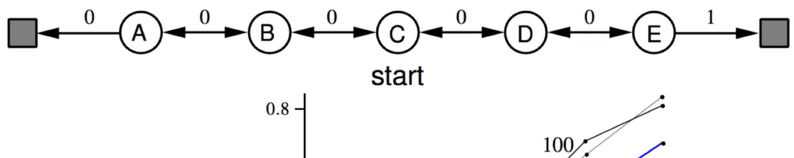

  

There are two actions ( left and right ) and we are considering an uniform random policy ( 50% left, 50% right ).

  

The question is: what is the value function for this thing?

  

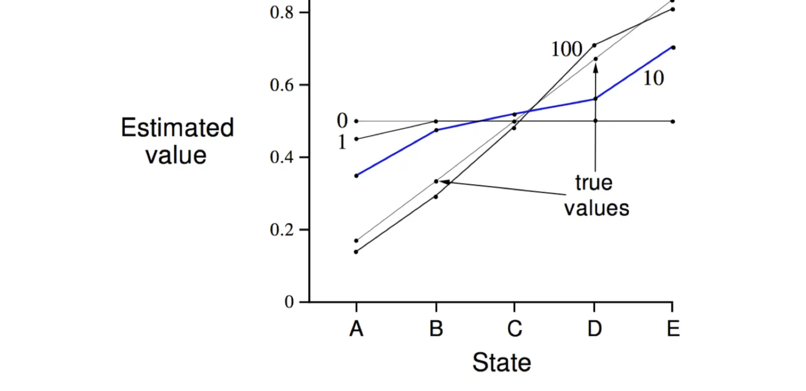

  

This is TD algorithm ( in particular TD(0) ).

  

We can start by initializing everything to 0.5 ( the line corresponding to 0 ) and then if we run for 1/10/100 episodes we see how the estimated values become more and more similar to the true values.

  

We can study the performance of the two algorithms MC and TD for random walk:

  

  

RMS is the Root Mean Squared error.

  

## Batch MD and TD

  

We know that $V(s) \rightarrow v_\pi(s)$ with MC and TD when the amount of episodes/experience is going to infinite but what happens when we stop after a finite number of episodes?

  

  

We show only $K$ episodes to the system and we keep iterating on them ( we sample iteratively the episode $k \in [1, K]$ ).

  

**Example: AB**

  

We have two states A and B with no discounting and we work with 8 episodes of experience:

  

  

We want to compute $V(A)$ and $V(B)$:

  

- $V(B) = \frac{6}{8} = 0.75$

- MC will see only one Reward in state A equal to 0 and it will estimate: $V(A) = 0$.

- TD will find something much more complex ( in the image we have the maximum likelihood mdp that explains the data ) for which $V(A) = 0.25 \cdot 0 + 0.75 \cdot 1 = 0.75$

  

  

Using batch solutions we have that:

  

- MC converges to solution with the minimum MSE ( best fit to the observed returns )

  

  

- TD(0) converges to solution of max likelihood Markov Model ( it builds implicitly the MDP structure )

- Solution to the MDP that best fits the data

  

  

## MC vs TD

  

- TD can lean before knowing the final outcome , so after every step while MC must wait until end of episode.

- TD can learn without the final outcome , from incomplete sequences ( it works in continuing non terminating environments ) while MC can only learn from complete sequences ( it works in episodic terminating environments ).

- MC has high variance but zero bias ( it has good convergence properties even with function approximation and it is not very sensitive to initial value )

- TD has low variance but it has some bias ( it is more efficient than MC but it is more sensitive to initial value ).

- TD(0) will converge to $v_\pi(s)$ but now always with function approximation

- TD exploits Markov property by building implicitly this mdp structure ( more efficient in Markov environments )

- MC does not exploit Markov property ( more effective in non-Markov environments )

  

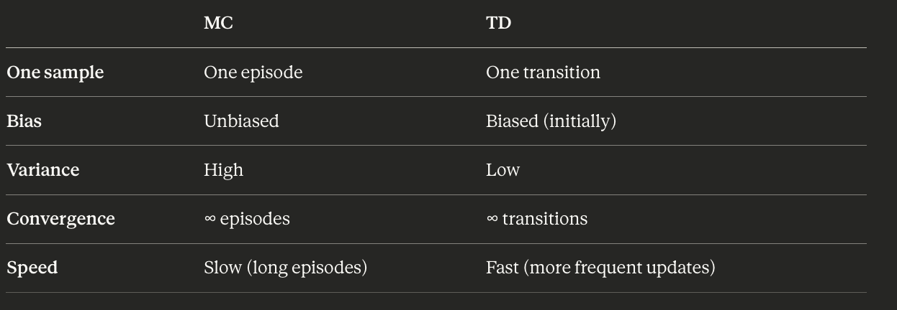

  

**Key point:** Both converge with infinity, but TD gets more "samples" per unit time because each step is a sample, not just each episode. That's why TD is faster in practice, not because it takes fewer samples.

  

## MC vs TD vs DP backups

  

Pictorial summary of where we are, we can think of these updates as backups where we start in some state and there is a look ahead tree ( a backup diagram that we saw for DP ):

  

- Monte-Carlo Backups

  

$$

V(S_t) \leftarrow V(S_t) + \alpha(G_t - V(S_t))

$$

  

  

It samples a complete trajectory/episode just by interacting with the environment.

  

- Temporal Difference Backups

  

$$

V(S_t) \leftarrow V(S_t) + \alpha \left( R_{t+1} + \gamma V(S_{t+1}) - V(S_t) \right)

$$

  

  

We consider only the state ahead and we get the reward, we back up this value to update the value function the state before in the root node.

  

- Dynamic Programming Backups

  

$$

V(S_t) \leftarrow \Epsilon_\pi[R_{t+1} + \gamma V(S_{t+1})]

$$

  

  

We see the state ahead but we don’t sample and for this reason we need to compute a full expectation ( we need to know the environment/dynamic, the probability of taking an action and ending in a specific state rather than another one )

  

## Bootstrapping and Sampling

  

- Bootstrapping means that we don’t actually use the real return but our estimation of it.

- Update involves an estimate

- DP and TD bootstraps while MC does not.

- Sampling means updates involving an expectation: we don’t need full width / every trajectories but just sample the mdp dynamics.

- DP does full width updates by considering every possibility exhaustively

- TD and MC sample.

  

This is the space of unified view of methods for policy evaluation

  

  

## TD($\lambda$)

  

We have seen TD(0) called TD 1 step where the agent takes one action and it will end up in some successor State and we use its value function to make a prediction on the final return with its immediate return.

  

We want to generalize this concept to **n steps** and not just one.

  

  

When $n=\infty$ we end up in doing Monte Carlo approach.

  

  

We can generalize it by defining the **n-step return** as:

  

$$

G^{(n)}_t = R_{t+1} + \gamma R_{t+2} + . . . + \gamma^{n-1} R_{t+n} + \gamma^n V(S_{t+n})

$$

  

TD(n) is defined as:

  

$$

V(S_t) \leftarrow V(S_t) + \alpha ( G_t^{(n)} - V(S_t))

$$

  

**Example** Large Random Walk:

  

  

Online means that we update immediately the value functions meanwhile Offline when we wait for the end of the episode to update them ( updates are accumulated within episode and then they are applied in batch at the end of episode ).

  

The goal is to come up with an algorithm that gets the best of all n.

  

### $\lambda-$Return

  

We want to efficiently consider all n at once , a way to do that is averaging over these N-Step Returns: we don’t have to commit to one of them, we can actually take a Target which combines multiple n-step returns together.

  

  

In this case we have one back up that makes the average over the 2-step and 4-step returns. This return will be much more robust because it gets the best of both of these cases.

  

We want to do something like that but for all **n →** this is what the $\lambda-$Return algorithm does.

  

It uses the $\lambda-$return $G_t^\lambda$ which combines all n-step returns $G_t^{(n)}$ through a weighted sum.

  

### Forward-view TD($\lambda$)

  

This is the TD($\lambda$) weighting function

  

$$

G_t^\lambda = (1-\lambda) \sum_{n=1}^\infty \lambda^{n-1} G_t^{(n)}

$$

  

  

  

It is also called **Forward-View TD($\lambda$)** which is very similar to Monte Carlo because we have to wait all the way until the end of the episode to our n-step returns. This algorithm suffers of some of the disadvantages the we had with Monte Carlo.

  

### Backward-view TD($\lambda$)

  

We want to achieve the result of forward view but with the nice properties of TD learning where we update online, every step and using incomplete sequences.

  

$$

E_0(s) = 0\\

E_t(s) = \gamma \lambda E_{t-1}(s) + 1(S_t=s)

  

$$

  

**Eligibility traces** combine**:**

  

- Frequency heuristic: assign credit to most frequent states

- Recency heuristic: assign credit to most recent states

  

  

It represent the eligibility trace for one particular state over time: we increase each time we visit a state and after a certain time that we don’ see it , the value starts to decade exponentially ( it combines both frequency and recency ).

  

Backward view TD($\lambda$) algorithm works by:

  

1. Keeping an eligibility trace for every state $s$

2. Updating value $V(s)$ for every state $s$ in proportion of TD-error $\delta_t = R_{t+1} + \gamma V(S_{t+1}) - V(S_t)$ and eligibility trace $E_t(s)$

  

$$

V(s) \leftarrow V(s) + \alpha \delta_t E_t(s)

$$

  

  

## TD(0) and TD($\lambda$)

  

When $\lambda=0$ , only the current state is updated and it is equivalent to TD(0) update:

  

$$

E_t(s) = 1(S_t = s) \\

V(s) \leftarrow V(s) + \alpha \delta_t E_t(s)

$$

  

$\lambda$ says how fastly we decay this thing, if it is 0 we decay it completely straight down.

  

When $\lambda=1$ ( the other extreme ), the credit is deferred all the way to the end of the episode. Considering offline updates and an episodic environments , the total update for TD(1) is the same as total update for MC.

  

  

The notation **1(S = s₁)** is an **indicator function** (also called a **characteristic function**).

  

**It means:**

  

- 1(S = s₁) = **1** if S equals s₁ (the condition is true)

- 1(S = s₁) = **0** if S does not equal s₁ (the condition is false)

  

## Summary of Forward and Backward TD($\lambda$ )

  

  

# Model Free Control

  

We want to optimise the value function of an **unknown MDP →** find the most optimal behavior ( the one that extracts the most reward ).

  

For most of the following problems ( in the image ) we can model them as MDPs

  

  

And the MDP model could be:

  

- Unknown, but experience can be samples

- Known but it is too big to use

  

In both cases we should relay on Model-free control approaches.

  

It is important to define:

  

- On-policy Learning → learn on the job

  

Learn about policy $\pi$ from experience sampled from $\pi$ ( we just follow the policy and we learn about it )

  

- Off-policy Learning → look over someone’s shoulder

  

Learn about policy $\pi$ from experience sampled from $\mu$ ( we are watching some other agent and we are trying to figure out the optimal behavior through it ).

  

We learn from one policy while following another

  

## On-Policy Monte-Carlo Control

  

### Generalised Policy Iteration GPI

  

GPI is the general framework of alternating evaluation + improvement:

  

  

it is a loop where first we evaluate the policy ( we estimate $v_\pi$ applying an iterative policy evaluation ) and then we improve it through a greedy approach ( we generate a new policy which is always better or equal to the oldest one $\pi' \geq \pi$ ).

  

### Generalised Policy Iteration with MC Evaluation

  

The policy evaluation is estimated using MC policy evaluation $V = v_\pi$ and for the policy improvement we use greedy policy improvement.

  

However there is a big problem here:

  

- The greedy policy improvement over $V(s)$ requires a model of MDP

  

$$

\pi'(s) = \argmax_{a \in A} R^a_s + P_{ss'}^a V(s')

$$

  

When we work with the value function we need always a model to do our policy improvement ( we need to know the probability transition matrix $P_{ss'}^a$ which is related to the dynamic of the world ).

  

The **alternative** is to use $Q(s,a)$ the action-value function which enables us to do control in a model free setting.

  

$$

\pi'(s) = \argmax_{a \in A} Q(s,a)

$$

  

We will perform **Generalised Policy Iteration with Action-Value Function**

  

  

**Example** Greedy Action Selection:

  

We have two doors and we are trying to pick the best door ( **bandit problem** )

  

  

We are trying to resolve it using a trial and error approach.

  

Acting greedily means we always open the right door in this example forever , the problem is we don’t know what there is behind the left door: we opened it just one time.

  

In order to guarantee that we visit all states and actions we apply the $\epsilon-$Greedy Exploration: the simplest idea is either we take the best actions or we exploit it randomly:

  

- Choose the greedy action with probability $1-\epsilon$

- Choose a random action with probability $\epsilon$

  

  

It ensures a continual exploration ( all m actions are tried with non-zero probability ).

  

We can define the $\epsilon-$**Greedy Policy Improvement** and its theorem as:

  

  

Proof:

  

  

We end up with Monte-Carlo Policy Iteration:

  

  

We changed both policy evaluation ( monte carlo approach ) and improvement ( we use the $\epsilon-$greedy algorithm ).

  

It is not always necessary to fully evaluate our policy and to go to the top of this line every time;sometimes we can just spend few steps to evaluate our policy and we have already got enough information there to guide us to a much better policy without wasting many many more iterations.

  

  

In the context of MC we can think of doing that in every single episode: we make our agent do one episode, collect all the steps along and we update the q-values just for those steps ( we are updating the mean value just of those visited states and tried actions along the episode ) - why wait to get more information from new episodes when we can already improve the policy?

  

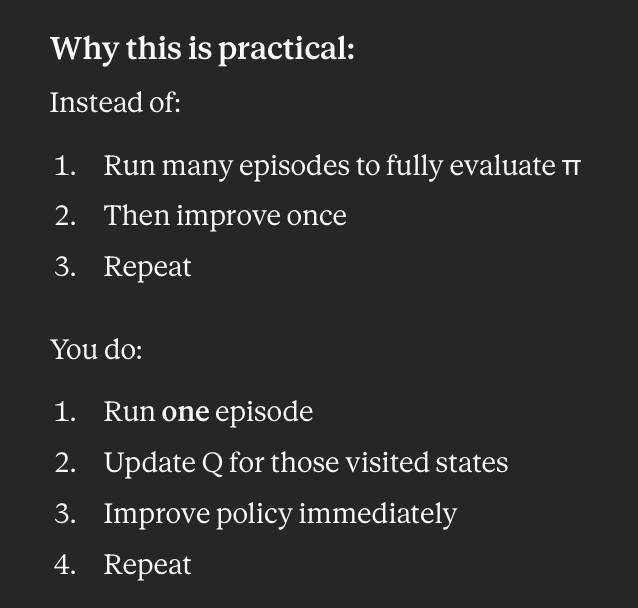

  

We come up with **GLIE ( Greedy in the Limit with Infinite Exploration )** which is an algorithm used to balance exploration and acting greedily ( exploitation ).

  

It ensures the convergence of our algorithm to find $\pi^*$ and it is composed by two parts:

  

1. Infinite **exploration**→ All state-action pairs must be visited infinitely often during learning

  

$$

\lim_{k \rightarrow \infty}N_k(s,a) = \infty

$$

  

Explore widely ( high $\epsilon$ )

  

Visit every pair $(s,a)$ many times.

  

1. Greedy in the limit → eventually, the policy becomes greedy (purely **exploits**)

  

$$

\lim_{k\rightarrow\infty} \pi_k(a|s) = 1(a=\argmax_{a'\in A} Q_k(s,a'))

$$

  

As the time goes on $\epsilon$ decreases ( $\epsilon \rightarrow 0$ as $t \rightarrow \infty$ ) and we eventually stop exploring and act optimally.

  

### GLIE Monte-Carlo Control

  

The algorithm is the following one:

  

- We sample the k-th episode using $\pi$

  

$$

{S_1,A_1,R_2, ... ,S_T} \sim \pi

$$

  

- For each state $S_t$ and action $A_t$ we update our action value and we do that by increment the count and updating the mean.

  

$$

N(S_t, A_t) \leftarrow N(S_t, A_t)+1 \\

Q(S_t,A_t) \leftarrow Q(S_t, A_t) + \frac{1}{N(S_t,A_t)}\left( G_t - Q(S_t,A_t) \right)

$$

  

- After the policy evaluation steps we now want to improve our policy using the new action-value function computed

- We set $\pi$ acting greedily w.r.t. these new Q values.

- We set $\epsilon$ using the **Robbins-Monro** technique

  

$$

\epsilon \leftarrow \frac{1}{k}\\

\pi \leftarrow \epsilon-\text{greedy(Q)}

$$

  

GLIE Monte Carlo Control converges to optimal action-value function

  

$$

Q(s,a) \rightarrow q_*(s,a)

$$

  

## On-Policy Temporal Difference Learning

  

We know that TD learning has some advantages over MC:

  

- Lower variance

- Online

- It works also with incomplete sequences

  

The natural idea can be to use TD instead of MC as policy evaluation ( apply TD to $Q(S,A)$ ) and use $\epsilon-$greedy policy improvement updating every time-step.

  

The general idea is called SARSA.

  

### Updating Action-Value Functions with Sarsa

  

We start off in some state action pair (S,A), we sample from the environment in order to get the reward and what new state we end up S’ in. We are going to re-sample our policy again in order to generate A’.

  

  

This is why it is called SARSA algorithm.

  

$$

Q(S,A) \leftarrow Q(S,A) + \alpha\left( R + \gamma Q(S',A') - Q(S,A) \right)

$$

  

We plug in the SARSA algorithm in our Generalization Policy Iteration framework.

  

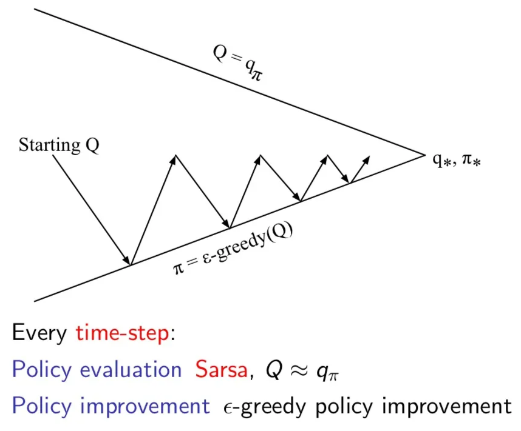

  

With MC we update the action-value after each episode , with SARSA we update it after each time-step ( we don’t need to reach the episode end ).

  

It is very similar to MC but it is faster because updates happen every step, not just episode-end.

  

**Algorithm**

  

  

SARSA convergese to the optimal action-value function $Q(s,a) \rightarrow q_\star(s,a)$ under the following conditions:

  

- GLIE sequence of policies $\pi_t(a|s)$

- Robbins-Monro seuqnce of step-sizes $\alpha_t$ , which means that we need to choose a step sizes $\alpha_t$ that satisfy $\sum_{t=1}^\infty \alpha_t = \infty$ and $\sum_{t=1}^\infty \alpha_t^2 < \infty$

  

**Example** Windy Gridworld

  

  

We want to move from the Start point to the Goal/Target point but there is the wind that moves up the agent of a specific number of cells specified below the grid ( 0 0 0 1 … ).

  

  

It shows the best optimal path and the learning curve for running Sarsa: how many timesteps are required by each episode to be completed.

  

### n-Step Sarsa

  

We consider the middle area of the spectrum that we saw before for finding a solution that takes both the advantages of MC and Sarsa.

  

We can consider the following n-step returns for $n=1,2, . . . , \infty$

  

  

We can define the n-step Q return:

  

$$

q_t^{(n)} = R_{t+1} + \gamma R_{t+2} + ... + \gamma^{n-1} R_{t+n} + \gamma^n Q(S_{t+n})

$$

  

The n-step Sarsa updates become:

  

$$

Q(s,a) \leftarrow Q(s,a) + \alpha \left( q_t^{(n)} - Q(S_t,A_t) \right)

$$

  

Now we want to make the lambda version of this algorithm: we are going to average over all of our n-step returns by weighting each n-step return by a factor of $(1-\lambda) \lambda^{n-1}$

  

The $\lambda$ step return is computed as the weighted average of each n-step return:

  

$$

q_t^\lambda = (1-\lambda) \sum_{n=1}^\infty \lambda^{n-1} q_t^{(n)}

$$

  

And the **Forward-view SARSA($\lambda$)** is defined as:

  

$$

Q(S_t,A_t) \leftarrow Q(S_t,A_t) + \alpha (q_t^\lambda - Q(S_t,A_t))

$$

  

The problem with it is that we need to wait until the end of the episode to update the action-value: it is not an online update/algorithm, we don’t want to wait untill the end of the episode. For this reason we use **eligibility traces** , SARSA($\lambda$) has one eligibility trace for each state-action pair:

  

  

It says how much a state and an action is responsible for getting the final return: how much that state helps to getting to the final spot.

  

$Q(s,a)$ is updated for every state and action in proportion to TD-error $\delta_t$ and eligibility trace $E_t(s,a)$:

  

$$

\delta_t = R_{t+1} + \gamma Q(S_{t+1} , A_{t+1}) - Q(S_t,A_t)

\\

Q(s,a) \leftarrow Q(s,a) + \alpha\delta_tE_t(s,a)

$$

  

This is the **Backward View Sarsa($\lambda$)**.

  

**Sarsa($\lambda$) Algorithm**

  

  

**Example** Sarsa$(\lambda)$ applied to GridWorld:

  

  

You propagate the importance of each step backwards and you need a lot of episodes to arrive to the initial step ( the arrow dimension represents its eligibility trace for that state and action ).

  

## Off-Policy Learning

  

While we are following a behaviour policy $\mu(a|s)$ we want to evaluate a target policy $\pi(a|s)$ to compute $v_\pi(s)$ or $q_\pi(s,a)$.

  

Reasons behind that:

  

- We want to learn from observing humans or other agents

- We want to re-use experience generated from old policies.

- We want to learn about optimal policy while following exploratory policy

- We want to learn about multiple policies while following one policy

  

### Importance Sampling

  

It is the first off policy learning mechanism: we estimate the expectation of a different distribution

  

  

We take this expectation and we say that an expectation over our future reward is just sum over some probabilities times how much reward we got. We multiply and divide by a new Distribution and it becomes an expectation over the new distribution of something else that just $f(X)$.

  

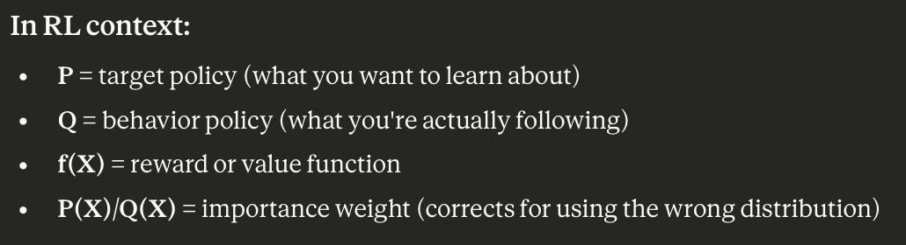

  

This is the foundation of off-policy learning:

  

- You can learn about an optimal policy P

- While following an exploratory policy Q

- By weighting samples appropriately

  

**1. Importance Sampling for Off-Policy Monte-Carlo**

  

We use the returns generated from $\mu$ to evaluate $\pi$ and we weight the return $G_t$ according to similarity between policies.

  

We have to multiply these important sampling rations across all the entire trajectory like every single step ( the it does not work because over many steps our target policy and behaviour policy never match enough for it to be useful ).

  

  

We multiply these ratios for every step in the entire trajectory (from t to T), each ratio is composed by two small numbers ( two probabilites ) which will give us a big number if the two policies are not aligned / different ( e.g. $\frac{0.9}{0,1} = 9$ ).

  

For some trajectories the two policies diverge and the weights become astronomically large ( trajectories with a lot of steps can end with weights in terms of $10^{10}$ ).

  

We update value towards corrected return

  

$$

V(S_t) \leftarrow V(S_t) + \alpha(G_t^{\pi/\mu} - V(S_t))

$$

  

It is extremely high variance and in practice **it is just useless.**

  

**2. Importance Sampling for Off-Policy TD**

  

When we work with off policy learning we need to use TD ( MC is unavailable due the high variance ).

  

We apply importance sampling not to whole trajectory but just for one single step: we just use one importance weight $\frac{\pi(A_t|S_t)}{\mu(A_t|S_t)}$ giving us a much more stable update

  

$$

G_t^{\pi/\mu} = \frac{\pi(A_t|S_t)}{\mu(A_t|S_t)} G_t

$$

  

Where $G_t = R_{t+1} + \gamma V(S_{t+1})$

  

We get our final update rule:

$$

V(S_t) \leftarrow V(S_t) + \alpha \left( \frac{\pi(A_t|S_t)}{\mu(A_t|S_t)} (R_{t+1} + \gamma V(S_{t+1})) - V(S_t) \right)

$$

It has much lower variance than MC importance sampling because policies need to be aligned/similar only over a single step.
### Q-Learning
We now consider off-policy learning of action-values $Q(s,a)$ and no importance sampling is required.
We are going to select our next action using our behaviour policy $\mu$ but we are going to consider also some alternative successor action that we might have taken following our target policy $\pi$.

How it works:
- Take action from behavior policy $A_t \sim \mu(\cdot |S_t)$ → we follow an exploratory policy
- Consider an alternative action $A' \sim \mu(\cdot | S_t)$ instead of using the action you actually took → we imagine what the target policy would do
- Update $Q(S_t, A_t)$ towards that alternative action→ we bootstrap from the alternative action’s value.
$$
Q(S_t, A_t) \leftarrow Q(S_t,A_t) + \alpha \left( R_{t+1} + \gamma Q(S_{t+1}, A') - Q(S_t, A_t) \right)
$$

The importance weight is built into the action selection and there is no nedd for importance sampling corrections ( no need for an explicit weight and for this reason we are avoiding the variance problem ).
The weighting is not needed because we are not directly computing an expectation under $\pi$ but we are using the **max operator**

$$

\pi(S_{t+1}) = \argmax_{a'} Q(S_{t+1},a')

$$

The target policy $\pi$ is **greedy** w.r.t. $Q(s,a)$ and the behaviour policy is acting $\epsilon-$greedy ( exploitation and exploration ) :both of them are improving!

Key insight: The max is not a sample from any policy!

  

- You don't sample A' from π

- You don't sample A' from μ

- You deterministically pick the best action using argmax

- This implicitly represents the optimal policy

  

Q-learning target simplifies to:

  

  

**Q-Learning Control algorithm** ( with SARSAMAX updateds ):

  

  

Q learning updates a little bit in the direction of the best/maximum Q value that you could have after one step.

  

  

Theorem: Q-Learning algorithm control converges to the optimal action-value function $Q(s,a) \rightarrow q_\star(s,a)$.

  

### Relationship between DP and TD

  

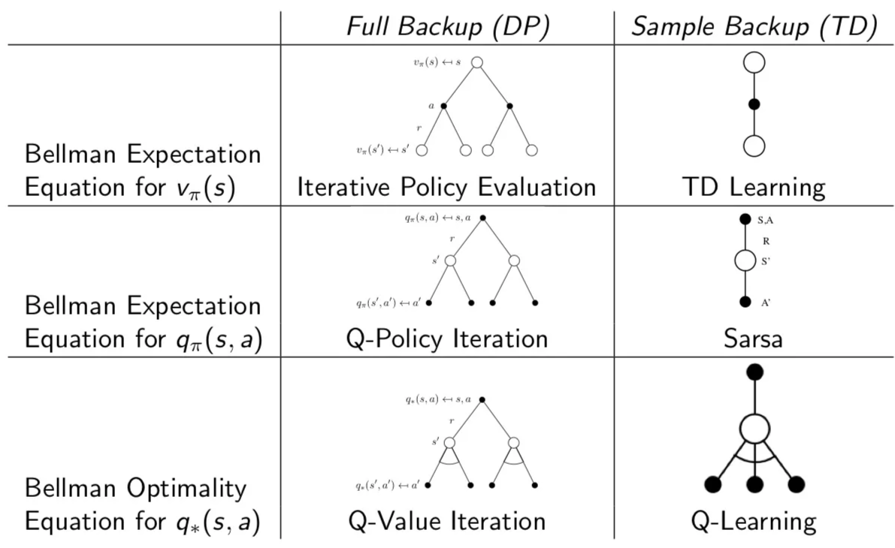

  

  

In general, for Bellman Expectation Equation we can use DP or we can just sample it using TD. We can think of TD as a sampling of the bellman expectation/optimality equations.

  

**TD algorithms are sampled versions of the corresponding DP algorithms.**

  

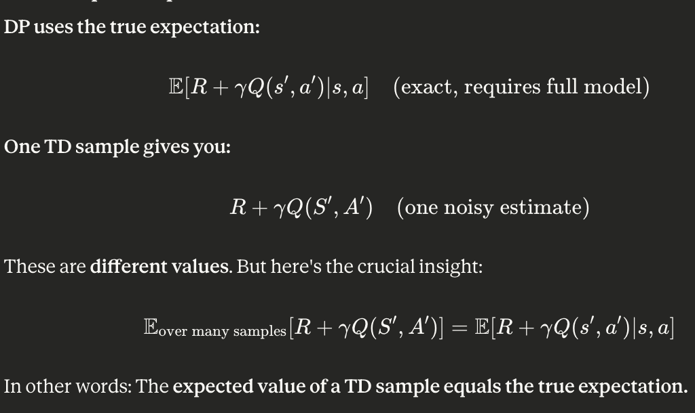

  

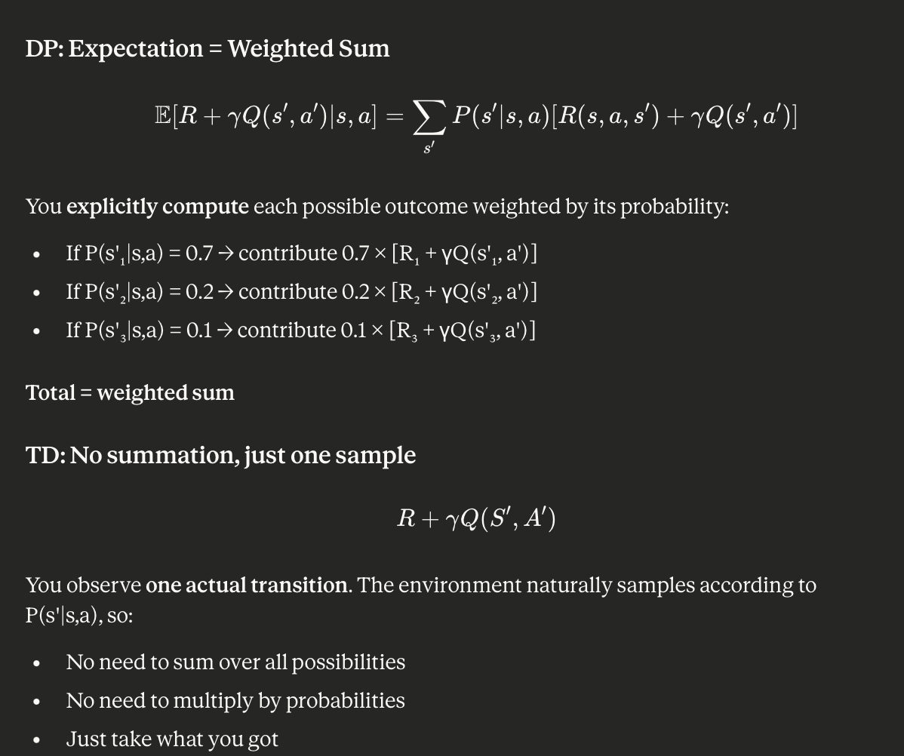

  

The environment naturally samples according to $P(s'|s,a)$ because we will sample n times and it is normal that we will get more values that are much more probable which will move the average towards them implicitly.

  

This table shows that **every DP algorithm has a TD counterpart**. You don't need to memorize separate algorithms—understand the Bellman equations and whether you're doing full backups or sampling.

# Value Function Approximation

  

RL can be used to solve large problems ( with a lot of number of states ) like:

  

- Backgammon: $10^{20}$

- Computer Go: $10^{170}$ states

- Helicopter: continuous state space

  

When we work with continuous state space, we can not build a table where we have a separate value for each state because it is not going to scale up. We need model-free methods that scale up for prediction and control: we need a value function approximation.

  

So far we have represented the value function as a **lookup table** where every state s has an entry $V(s)$ or every state s and action s pair has $Q(s,a)$. For problem with large MDPs , there are too many states/actions to store and it is too slow to learn the value of each of them individually. We **estimate** our value function with **parametric function approximation:**

  

$$

\hat{v}(s,\textbf{w} ) \approx v_\pi(s) \\

\hat{q}(s,a,\textbf{w}) \approx q_\pi(s,a)

$$

  

$\textbf{w}$ is a vector of weights ( e.g. parameters of NN ).

  

We want to build a function approximation that fits $v_\pi(s)$ or $q_\pi(s,a)$ across the whole state space ( and action space ) using a compact representation through a smaller number of weights than the states ( and actions ) in the whole state space ( and action space ).

  

Using a small number of weights w.r.t the total number of states allows us to decrease the memory required but also to generalize from seen states to unseen ones by querying the function approximation.

  

We will do that by updating these weights/parameters using the methods seen so far ( MC or TD learning ).

  

There are three different types/architectures of function approximations :

  

1. State-value function approximation

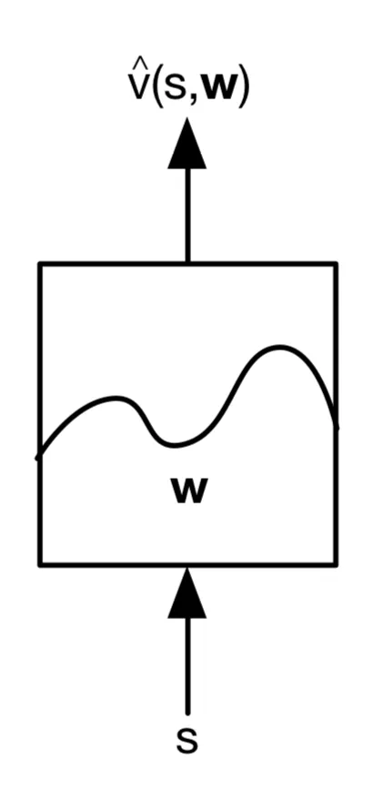

2. Action-value function approximation → we have got two choices

3. Action in Action-value function approximation → i am in the state s and i am considering the action a, how good would that be? The function approximator will give us the estimator by using the weights

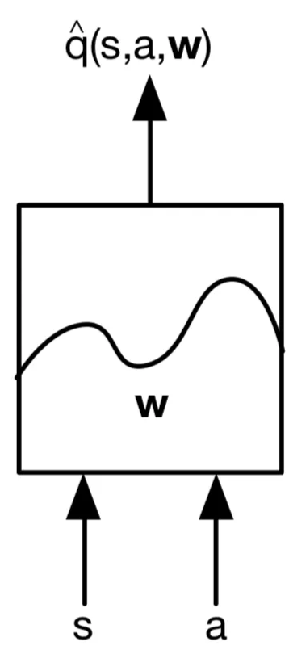

2. Action out Action-value function approximation → we want in state s and we want our function approximator to tell us the value of all actions that i might take.

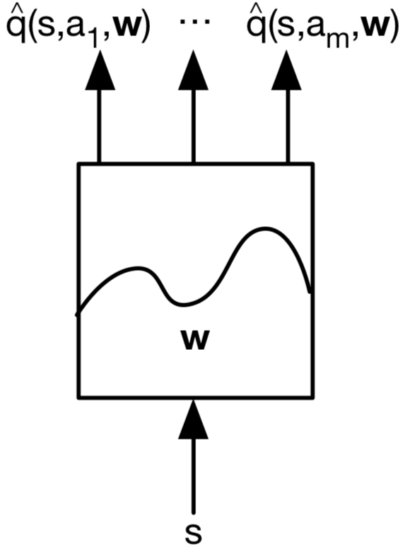

  

We can use anything we like as black box function approximator, any tool:

  

- Linear combinations of feature

- Neural Network

- Decision Tree

- Nearest Neighbour

- Fourier bases

- ecc…

  

BUT we must consider **differentiable** function approximators ( first two of this list ) and a training method that is suitable for non-stationary and non-iid data.

  

## Incremental methods

  

### Gradient Descent

  

Considering a differentiable function $J(\textbf{w})$ of parameter vector **w** , we can define its gradient as:

  

  

  

It gives us the direction of the steepest descent/ascent and we are going to follow this downhill in order to find a local minimum of $J(\textbf{w})$.

  

We adjust our parameters $\textbf{w}$ in the direction of the gradient ( downhill due the minus)

  

$$

\Delta \textbf{w} = - \frac{1}{2} \alpha \nabla_{\textbf{w}}J(\textbf{w})

$$

  

where $\alpha$ is a step-size parameter.

  

We want to use it in value function approximation, in this case we are assuming we are doing supervising learning: someone ( an oracle ) is giving use the true $v_\pi(s)$ .

  

We want to find a parameter vector $\textbf{w}$ minimize the Mean Squared Error ( MSE ) of the difference of the approximate value function $\hat{v}(s,\textbf{w})$ and true value function $v_\pi(s)$

  

$$

J(\textbf{w}) = E_\pi[(v_\pi(S) - \hat{v}(S,\textbf{w})^2]

$$

  

We use the gradient descent to find a local minimum ( we plug in the approximation function chosen )

  

  

We apply the chain rule and we know that our oracle does not depend on $\textbf{w}$.

  

Instead of explicitly computing this expectation , we are going to randomly sample a state ( by just seeing which state we visited ) which is called **Stochastic Gradient Descent** ( which samples the gradient )

  

$$

\Delta \textbf{w} = \alpha( v_\pi(S) - \hat{v}(S,\textbf{w})) \nabla_\textbf{w} \hat{v}(S,\textbf{w})

$$

  

Even if we change things online ( updates step after step ) then we still arrive at minimizing what we want.

  

Stochastic gradient descent (SGD) does **not** guarantee convergence to the global optimum in non-convex problems. It typically converges to a local optimum or saddle point.

  

### Linear Function Approximation

  

We want represent a state by a **feature vector**

  

  

Each of these features is a property ( a number ) which tells you some piece of information about our state→ Each feature is a representation that characterizes the state space.

  

Examples:

  

- Distance of robot from landmarks

- Trends in the stock market

  

Supposing someone gave us our feature vector ( how to find me will not be covered in this course ) , we can approximate the value function by a linear combination of features

  

$$

⁍

$$

  

Its objective function is the MSE which is quadratic in parameters $\textbf{w}$

  

$$

J(\textbf{w}) = E_\textbf{w}[(v_\pi(s) - x(S)^T\textbf{w})^2]

$$

  

Stochastic gradient descent converges to the global optimum due to the quadratic and convex nature of the function.

  

The update rule is particularly simple:

  

  

**Table Lookup** is a special case of linear value function approximation where we use table lookup features:

  

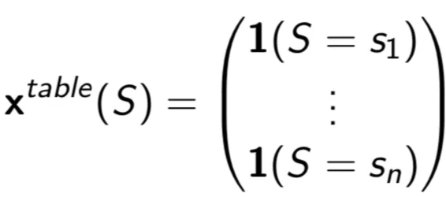

  

That says if i am in state one i have a feature value of one otherwise i will have 0 and all way down until the final state: all of them are 0 except for the one related to state where i am now ( one hot encoding ).

  

If we use this approach, the approximation just consists of selecting one weight value.

  

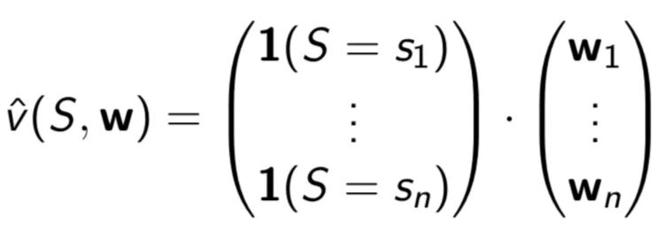

  

### Incremental Prediction Algorithm
